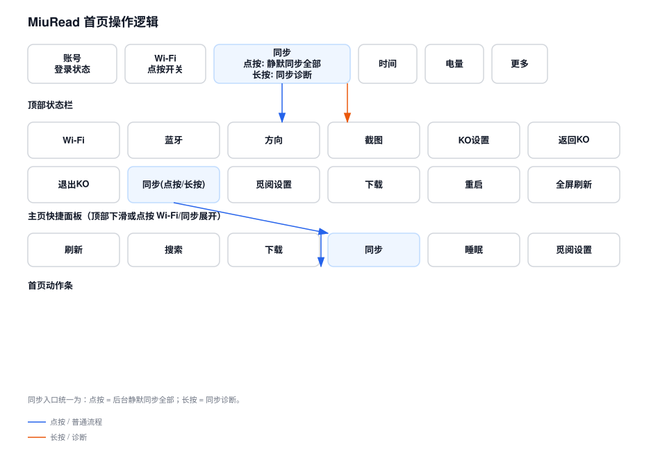
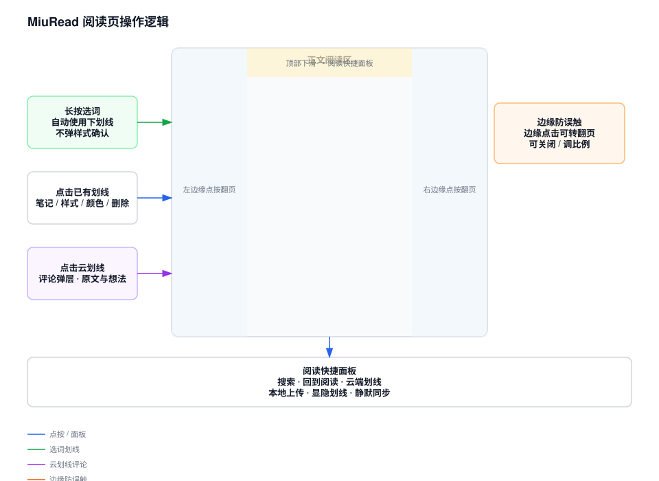
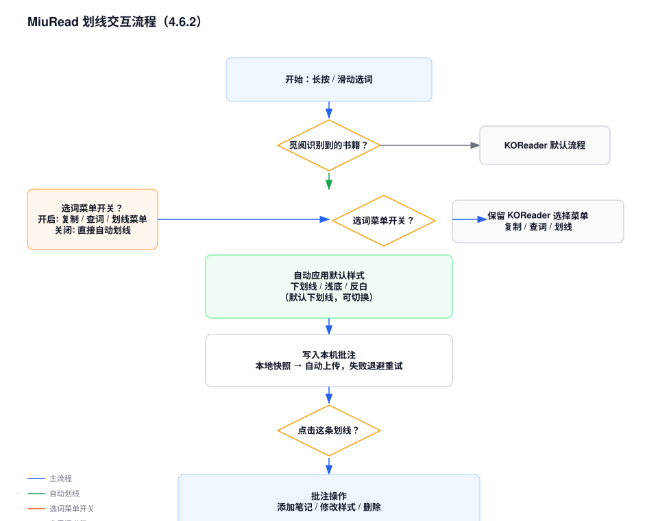
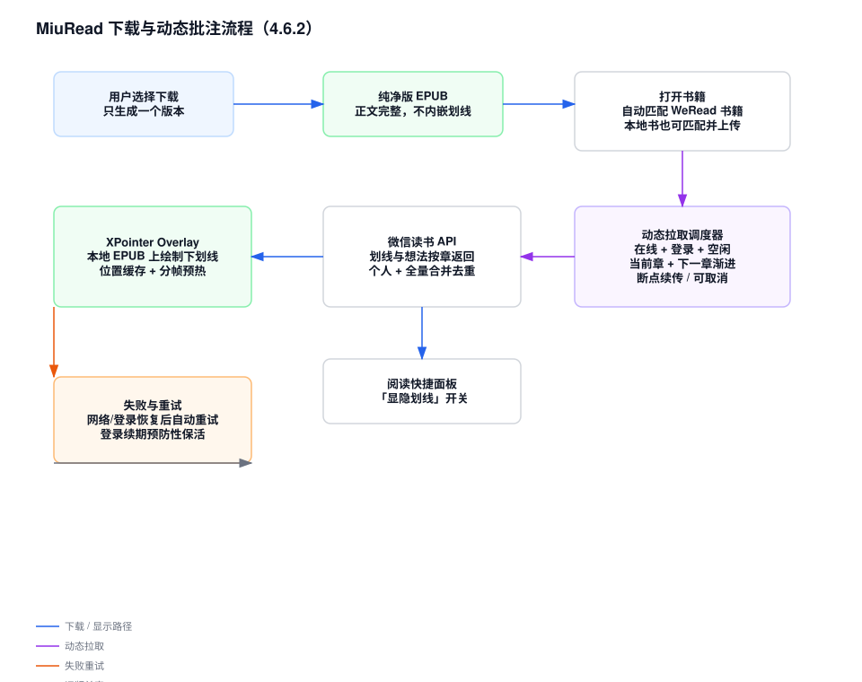
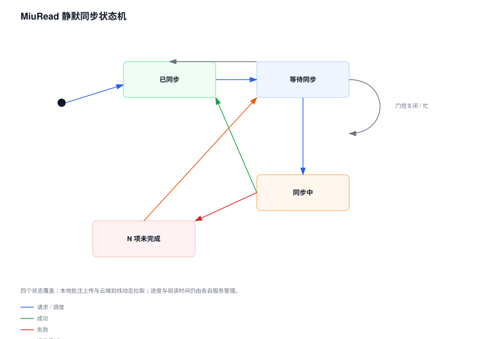

# MiuRead · WeRead Assistant

MiuRead（觅阅 · 微信读书助手）是面向 KOReader 的非官方微信读书客户端。本仓库为 **Stable / 正式版通道**。

## Current Release

当前版本：`4.5.41`。

完整版本记录见 [`CHANGELOG.md`](CHANGELOG.md)。

## Highlights

- **微信读书客户端**：搜索、书架、下载、阅读进度与阅读时间同步、扫码登录。
- **单一 EPUB 版本**：下载只生成「纯净版」，不再需要单独下载「划线与想法版」；旧的划线与想法版文件继续可读，并在菜单中标注为旧版。
- **动态划线与想法**：阅读时按「当前章 + 下一章」静默拉取微信读书划线与想法，随阅读推进自动补充；无需重新生成 EPUB，使用 XPointer overlay 直接绘制，支持取消与断点续传。
- **本地书匹配**：任意重排本地 EPUB/TXT 可匹配微信读书书籍，同步个人划线/想法到当前书显示；阅读快捷面板提供 `云端划线`、`本地上传`、`显隐划线` 等图标。
- **静默同步**：本地批注改动后自动上传，失败自动退避重试；主页同步入口点击一键同步、长按查看诊断。
- **阅读进度冲突自动处理**：默认自动采用云端位置（可在同步设置中改为询问），云端来源不一致时仍保留人工选择。
- **默认下划线**：觅阅识别到的书籍中，选词后默认直接下划线，不再二次确认样式；点击已有划线仍可进行笔记、样式、删除等操作。

## UI 操作示意图

以下 SVG 图放在 `docs/diagrams/`，用于快速理解 MiuRead 的主要操作逻辑。生成脚本：`docs/diagrams/generate_ui_diagrams.py`（纯 Python 标准库，可重复生成）。

### 首页操作逻辑



### 阅读页操作逻辑



### 划线交互流程



### 下载与动态批注流程



### 静默同步状态机



## Installation

1. 在 GitHub Releases 下载最新正式版 `miuread-vX.Y.Z-full.zip`。
2. 解压后将完整的 `miuread.koplugin` 目录放入 KOReader 的插件目录。
3. 完整重启 KOReader。
4. 后续正式版可使用 MiuRead 内置更新功能升级。

## Development

本仓库主要开发分支为 `feature/local-book-annotations`；正式版通过 `vX.Y.Z` tag 发布，tag、`miuread.koplugin/miuread/config.lua` 与 `miuread.koplugin/_meta.lua` 的版本保持一致。

完整的向上游贡献改动清单见 [`docs/UPSTREAM-CONTRIBUTION.md`](docs/UPSTREAM-CONTRIBUTION.md)。

本地测试：

```bash
# Lua 5.1 无头测试（Windows 本地：.tools\lua51.exe tests/lua/run.lua）
lua5.1 tests/lua/run.lua
python -m unittest discover -s tests
```

## OTA Update Channel

从 `4.3.0` 起，正式版更新清单由 GitHub Actions 在发布时自动生成，并发布到固定 `stable-channel` Release。

- 新版正式 OTA：`stable-channel/update.json`
- 仓库根目录 `update.json`：仅作为旧正式版桥接入口
- 发布 `4.3.0` 时，workflow 会把根目录 `update.json` 更新为 4.3.0 并保持冻结，使 4.1.2 等旧版先升级到 4.3.0，再自动切换到新 OTA 通道。

## Release Process

- Stable tag：`vX.Y.Z`
- Stable Release：GitHub 正式 Release
- 版本记录：统一维护 `CHANGELOG.md`
- 创建正式 tag 后，GitHub Actions 自动校验版本、执行 Lua 5.1 语法检查、构建 full.zip、校验 SHA-256 与公开下载地址，并更新固定正式 OTA 清单。
- tag、`miuread.koplugin/miuread/config.lua` 与 `miuread.koplugin/_meta.lua` 中的版本必须一致。

## Origin and License

MiuRead originated as a modified version of `finlater/weread.koplugin` v0.1.1 and has since undergone substantial restructuring, modification, and extension.

MiuRead is an unofficial community project and is not affiliated with or endorsed by WeRead, Tencent, KOReader, or their maintainers.

This project is distributed under the GNU Affero General Public License version 3 only (`AGPL-3.0-only`). See `LICENSE`, `NOTICE`, and `THIRD_PARTY_NOTICES` for details.
